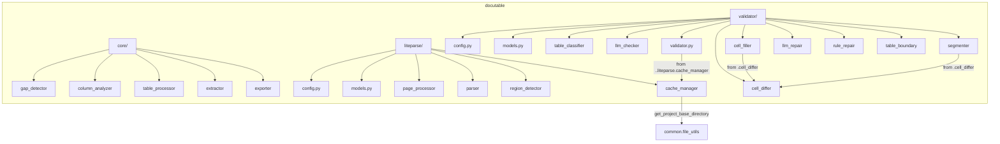

## 用户需求

将 DocuTable 项目的 `liteparse_extractor/`、`table_validator/` 和 `core/extractor.py`、`core/exporter.py` 源码搬运到 RAGFlow 的 `deepdoc/parser/docutable/` 包中，修复所有导入路径，适配缓存路径，并集成到现有解析器系统。

## 产品概述

完善 RAGFlow 的 `docutable` 表格解析子包，使其具备完整的 PDF 表格提取流水线：文本提取 → 表格检测 → 结构重建 → 交叉验证 → 差异修复。

## 核心功能

- **liteparse 解析通道**：基于 liteparse Grid Projection 算法逐页解析 PDF，保留空间布局文本，检测表格区域
- **表格验证器**：规则分类器判断真/假表格，LLM 5 维度深度验证，基于规则的表格结构修复
- **核心提取引擎**：pdfplumber + PyMuPDF 双引擎 PDF 表格提取，Excel/JSON 导出
- **缓存管理**：中间数据持久化与增量解析加速

## 技术栈

- **语言**: Python 3.10+
- **核心依赖**: pdfplumber, PyMuPDF (fitz), numpy, scikit-learn, liteparse (外部包), openpyxl
- **项目模式**: RAGFlow 约定 —— 遵循 Apache 2.0 协议头、`get_project_base_directory()` 路径解析、`common` 工具层

## 实现方案

### 整体策略

采用**文件搬运 + 导入修复 + 路径适配 + 集成注册**四步策略。将 DocuTable 项目中经过验证的 21 个文件搬运到 RAGFlow，修复 3 处跨包导入路径，适配 1 处缓存路径，最终在 `pdf_parser.py` 中以可选方式集成。

### 导入依赖图

### 需要修复的导入（3处）

| 文件 | 原导入 | 新导入 |
| --- | --- | --- |
| `validator/liteparse_cell_filler.py:30` | `from codes.table_validator.cell_differ import ...` | `from .cell_differ import ...` |
| `validator/liteparse_table_segmenter.py:66` | `from codes.table_validator.cell_differ import ...` | `from .cell_differ import ...` |
| `validator/validator.py:36` | `from codes.liteparse_extractor.cache_manager import load_parse_result` | `from ..liteparse.cache_manager import load_parse_result` |

### 需要适配的配置（1处）

`liteparse/config.py` 第46行 `MID_CACHE_ROOT` ：

- 原：`Path(__file__).resolve().parents[2] / "data" / "mid_cache"` （DocuTable 特有结构）
- 改为：使用 `common.file_utils.get_project_base_directory()` 获取项目根目录，拼接 `"data/mid_cache"`

### 性能考量

- `liteparse_table_segmenter.py`（192KB，5145行）是最大的文件，搬运后无需修改
- 缓存机制避免重复解析同一 PDF，文件哈希校验确保缓存一致性
- 所有重型操作（liteparse、LLM 调用）均为惰性加载，不会在 import 时触发

### 向后兼容

- `docutable` 包为新增模块，不影响现有解析器
- `pdf_parser.py` 集成采用可选导入模式，导入失败时静默降级
- 所有修改局限于 `docutable/` 目录内，不触碰其他代码路径

## 代理扩展

### SubAgent

- **code-explorer**
- 用途：批量复制文件前验证源文件完整性和目标目录结构
- 预期结果：确认所有 21 个源文件存在且可读，目标目录已正确初始化